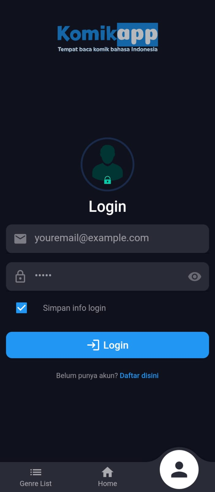
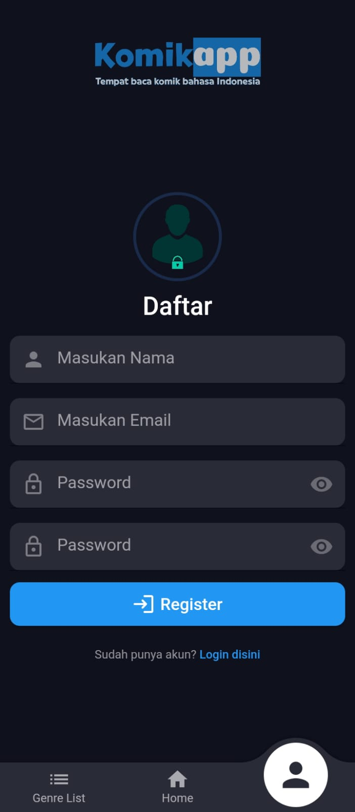
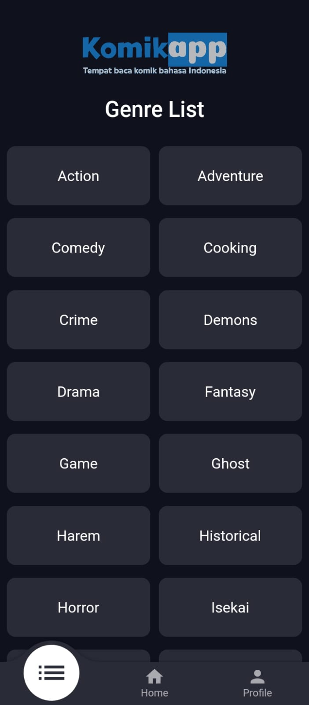
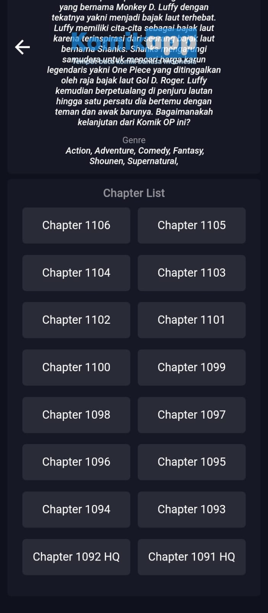

# Komikapp - Discover your favourite manga
Komikapp is an un-official manga reader app available on iOS and Android,
This app uses the un-official [komiku.id](https://github.com/MuhammadRizki003/komikku-api) API <br>
If you want to contribute on this project, you can fork this project and pull request.

## Features

- [x] manga update
- [x] manga detail
- [x] genre list
- [x] add to favourite(login required)
- [x] search manga by name

## Download Apk
> [Komikapp.apk](https://github.com/MuhammadRizki003/Komikapp/releases/tag/v1.0)

## ScreenShoot

 
 
 
 

## Build Setup
``` bash

# install dependencies
$ flutter pub get

# run debug mode
$ flutter run

# run release mode
$ flutter run --release

# build app bundle
$ flutter build appbundle

# build apk
$ flutter build apk

```

## Special Thanks
Thank you to friends who have supported me in making this application.  

Dependencies that I use :

-  animated_text_kit: ^4.2.2
-  carousel_slider: ^4.2.1
-  change_app_package_name: ^1.1.0
-  connectivity_plus: ^5.0.1
-  convex_bottom_bar: ^3.2.0
-  cupertino_icons: ^1.0.2
-  get: ^4.6.6
-  get_storage: ^2.1.1
-  http: ^1.1.0
